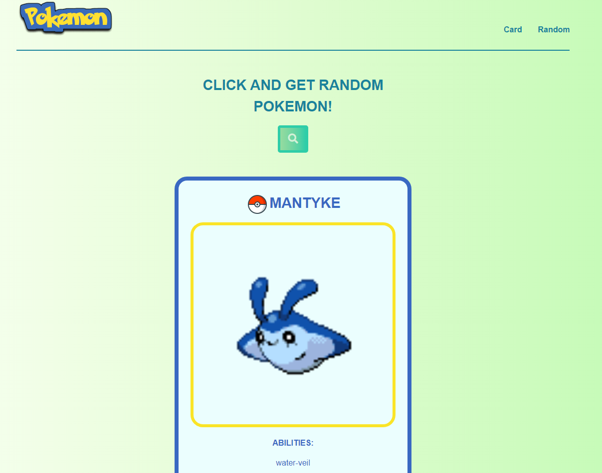
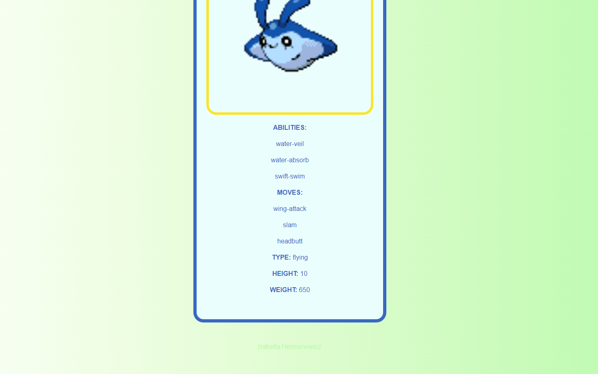

# Website with PokemonAPI
Main purpose of this website is to show random Pokemon with info about it everytime one click on the bottom. 
Colors and design should resemble simple, retro style of Pokemon games. 
Website handling is easy, you just click the bottom and new Pokemon appears.
It was made with Bootstrap, SCSS, HTML, JavaScript, Babel, Webpack.
It uses PokeAPI (https://pokeapi.co/) and ready to use ready-to-use schema (https://github.com/BohdanOne/webpack-babel-bootstrap-scss). 
There are 807 Pokemons to discover!

